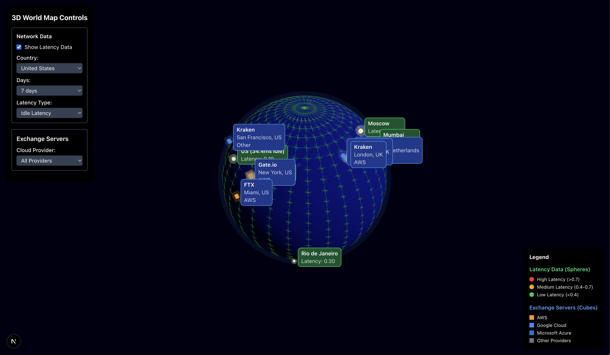

# 3D World Map with Exchange Server Locations & Real-time Latency Visualization
## Project Overview
This project is an interactive 3D world map that visualizes cryptocurrency exchange server locations and their real-time latency data. Built with Next.js, Three.js, and Cloudflare Radar API, it provides a comprehensive view of global exchange infrastructure and network performance.

## Features
### 🌍 3D World Map Display
Interactive 3D globe rendering with smooth camera controls

Rotate, zoom, and pan functionality for exploration

Responsive design that works across different screen sizes

### 💻 Exchange Server Visualization
Plot locations of major cryptocurrency exchanges (OKX, Deribit, Bybit, Binance, etc.)

Color-coded markers distinguish between AWS, GCP, and Azure hosted servers

Interactive tooltips showing exchange name, location, and cloud provider

Legend explaining marker types and colors

### ⚡ Real-time Latency Monitoring
Animated connections between exchange servers and cloud regions

Color-coded latency indicators (green/yellow/red for low/medium/high latency)

Data updates every 5-10 seconds via Cloudflare Radar API

Pulse effects and data streams to visualize network performance

### ☁️ Cloud Provider Regions
Visual representation of AWS, GCP, and Azure regions

Distinct styling for each provider's infrastructure

Region details including provider name, region code, and server count

Filtering options to show/hide specific cloud providers

Technologies Used
Frontend: Next.js with TypeScript

### 3D Rendering: Three.js

Data API: Cloudflare Radar

State Management: React Context/Hooks

Styling: CSS Modules/Tailwind (whichever you used)

### Clone the repository:
``` 
git clone [repository-url]
```

### Install dependencies:
```
npm install
# or
yarn install
```

### Set up environment variables:
```
CLOUDFLARE_API_TOKEN = your_api_token
``` 

### Run the development server:
```
npm run dev
# or
yarn dev
```

### Open your browser to:
```
http://localhost:3000
```


### Interface

